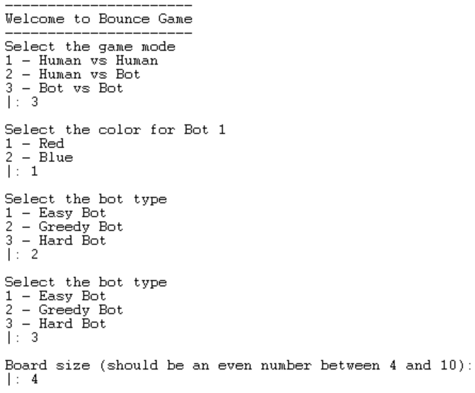
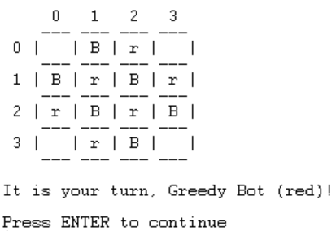
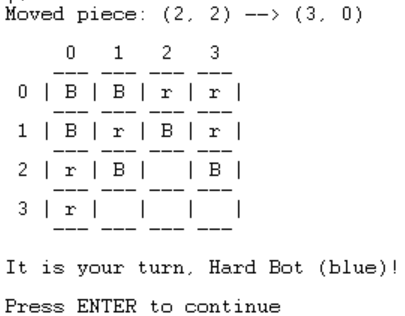
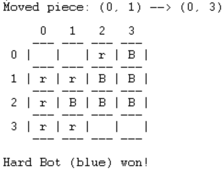

# PFL - Trabalho Prático 1 

## Identificação do Tópico e Grupo

Jogo N.º 4: **Bounce** - https://marksteeregames.com/Bounce_rules.pdf

Grupo: **Bounce_5**

* Manuel Ramos Leite Carvalho Neto - up202108744
* Matilde Isabel da Silva Simões - up202108782

A contribuição de cada elemento do grupo para o trabalho prático é 50%.

## Instalação e Execução

Para a correta instalação e execução do jogo (quer em ambientes Windows, quer em ambientes Linux), devem ser seguidos os seguintes passos:

1. Descarregar o ficheiro PFL_TP1_T12_Bounce_5.zip

2. Descompactar o ficheiro descarregado

3. Através do SICStus Prolog 4.8.0, consultar o ficheiro ***src/main.pl***

4. Iniciar o jogo, chamando o predicado ***play/0***: `| ?- play.`

## Descrição do Jogo

Bounce é um jogo de estratégia para dois jogadores que se desenrola num tabuleiro quadrado de tamanho par. Inicialmente, o tabuleiro é configurado com um padrão de peças vermelhas e azuis, deixando os quatro cantos vazios.

O jogo começa com o jogador das peças vermelhas e os turnos alternam entre os jogadores. Em cada turno, um jogador pode mover uma das suas peças para uma casa vazia no tabuleiro, desde que o movimento siga uma regra crucial: a nova posição da peça deve fazer parte de um grupo maior após o movimento, em comparação com a situação anterior.

Por exemplo, se o jogador vermelho tem uma peça que faz parte de um grupo de tamanho 11 e decide movê-la para uma casa vazia, essa peça deve fazer parte de um grupo maior após o movimento, como um grupo de tamanho 20.

Se um jogador não tem nenhuma jogada disponível durante o seu turno, então é obrigado a remover uma das suas peças do tabuleiro, encerrando assim a sua jogada.

O jogador ganha ao conseguir - durante o seu turno - agrupar todas as suas peças num único conjunto ligado. Isto significa que todas as peças do jogador devem estar num único grupo, que é formado por todas as peças da mesma cor que estão adjacentes horizontal ou verticalmente.

O ficheiro utilizado obter a informação descrita anteriormente foi https://marksteeregames.com/Bounce_rules.pdf.

## Lógica do Jogo

Esta secção descreve o *design* e a implementação da lógica do jogo em Prolog, através dos sete tópicos seguintes.

Todas os predicados referenciados nas subsecções abaixo encontram-se no ficheiro `main.pl`.

### Representação do Estado Interno do Jogo

O estado interno do jogo é representado através de um termo composto por dois elementos: o tabuleiro e o jogador atual.

O tabuleiro é uma lista de listas (cujo comprimento é igual ao comprimento de cada lista interna, por ser um quadrado), em que cada lista representa uma linha do tabuleiro e cada elemento uma célula deste. Tanto as linhas como as colunas começam no índice 0.

As coordenadas das posições são representadas por estruturas Linha-Coluna.

```
board = [
    [0-0, 0-1, 0-2, 0-3],
    [1-0, 1-1, 1-2, 1-3],
    [2-0, 2-1, 2-2, 2-3],
    [3-0, 3-1, 3-2, 3-3]
].
```

Cada célula contém a peça (ou ausência de peça) presente em cada posição, representada através de um átomo.
Uma peça vermelha é representada internamente por `red`, uma peça azul por `blue` e uma posição vazia por `empty`.

O jogador atual é representado por um número, 1 ou 2, conforme se trate do jogador das peças vermelhas (sempre o primeiro a jogar, por imposição das regras) ou azuis, respetivamente.

Assim, exemplificam-se representações internas dos estados inicial, intermédio e final do jogo.

**Estado Inicial**
```
gameState = [
    [empty, blue, red, empty],
    [blue, red, blue, red],
    [red, blue, red, blue],
    [empty, red, blue, empty]
]-1.
```

**Estado Intermédio**
```
gameState = [
    [blue, blue, red, red],
    [blue, red, blue, red],
    [red, blue, empty, blue],
    [red, empty, empty, empty]
]-2.
```

**Estado Final**
```
gameState = [
    [empty, empty, red, blue],
    [red, red, blue, blue],
    [red, blue, blue, blue],
    [red, red, empty, empty]
]-1.
```

Neste estado final - conforme se explicará numa subsecção posterior - o jogador 2 (jogador das peças azuis) ganhou o jogo.

### Visualização do Estado do Jogo

A visualização do estado do jogo consiste na representação gráfica do tabuleiro e do jogador atual.

O tabuleiro é mostrado como um conjunto de células delimitadas por caracteres verticais (|) e horizontais (---), sendo cada célula identificada pelas suas coordenadas, expostas do lado esquerdo (número da linha) e na parte de cima do tabuleiro (número da coluna). A impressão do tabuleiro é feita com recursão (o cabeçalho indicador das colunas e a última linha delimitadora são impressos separadamente).

As peças vermelhas são representadas pela letra `r` e as peças azuis por `B`, enquanto as casas vazias são deixadas em branco.

Depois de impresso o tabuleiro, é também mostrado o turno do jogador atual e o seu nome, com a frase "It is your turn, ...".

O predicado encarregue por tudo isto é `display_game(+GameState)`, que chama os predicados adequados, como `print_header(+N, +HeaderSize)`, `print_board(+Board, +N)`, `print_board_line(+LineSize)` e `print_turn(+Name)`, entre outros.

Quando se trata de um *human* a jogar, é solicitada a introdução das coordenadas por parte do utilizador, seja para um movimento, seja para uma remoção de peça, quando aplicável. Esta *interface* é clara e facilmente entendível, sendo pedido um valor de cada vez, primeiro a linha e depois a coluna, primeiro para a posição de origem e depois para a posição de destino (se for caso disso).

Quando se trata de um *bot* a jogar, é indicado o seu turno e o programa aguarda por um ENTER do utilizador para realizar a jogada, imprimindo não só o tabuleiro resultante, mas também uma indicação visual da jogada efetuada (movimento/remoção e respetivas coordenadas).

No que diz respeito ao sistema de menus, a *interface* segue esta ordem:

1. Seleção do tipo de jogo (human-human, human-bot ou bot-bot)
2. Indicação do nome de um jogador ou da dificuldade do *bot* (conforme aplicável)
3. Seleção da cor do jogador e, consequentemente, se é o primeiro ou segundo a jogar
4. Indicação do nome do outro jogador ou da dificuldade do outro *bot* (conforme aplicável)
5. Indicação do tamanho do tabuleiro - existe, portanto, um predicado `initial_state(+BoardSize, -GameState)` que recebe um tamanho variável para o tabuleiro e retorna o estado inicial do jogo

No caso da escolha de uma opção do menu, essa seleção é feita através do número correspondente.

Em todos os casos, seja no jogo propriamente dito, seja no menu, todos os *inputs* do utilizador são validados e é obrigatório que seja introduzida uma opção/posição válida. Enquanto assim não for, os predicados de leitura de *inputs* não sucedem e pedem novo *input*.

Os três estados representados na subsecção anterior são visualizados nas imagens abaixo, bem como a interação com os menus que origina esse jogo.

**Menus**



**Estado Inicial**



**Estado Intermédio**



**Estado Final**



### Validação e Execução de um Movimento

Um movimento é uma estrutura LinhaOrigem-ColunaOrigem-LinhaDestino-ColunaDestino.

A validação de um movimento é constituída por cinco etapas, efetuadas sequencialmente:

1. A posição de origem, dada por LinhaOrigem-ColunaOrigem, é válida (dentro dos limites do tabuleiro)
2. A posição de destino, dada por LinhaDestino-ColunaDestino, é válida (dentro dos limites do tabuleiro)
3. A posição de origem contém uma peça do jogador atual
4. A posição de destino está vazia
5. O movimento da peça da posição de origem para a posição de destino resulta, obrigatoriamente, num grupo maior de peças para o jogador atual

Se todas estas condições forem satisfeitas, o movimento é executado.

Note-se que a verificação da condição 5. é efetuada através do recurso a um algoritmo de *flood-fill*, que permite determinar o tamanho (número de peças) do grupo de origem e do grupo de destino (com a peça lá colocada), seguindo-se a sua comparação.

A execução de um movimento, resultando num novo estado do jogo (tabuleiro e jogador), consiste em apenas três passos:

1. A peça presente na posição de origem é removida, isto é, a posição de origem passa a estar vazia
2. A peça anteriormente removida é colocada na posição de destino
3. Troca o turno do jogador

O predicado `Move(+GameState, +Move, -NewGameState)` é responsável pela validação e execução de um movimento, recorrendo a `can_move(+GameState, +Move)` para a primeira parte e a `player_piece(?Player, ?Piece)`, `move_piece(+Board, +Piece, +SourcePos, +DestPos, -NewBoard)`, `change_player(?Player, ?NewPlayer)` para a segunda.

Se não existirem movimentos válidos, o jogador atual deve remover uma das suas peças do tabuleiro e terminar a sua jogada, não sendo isto considerado um movimento, mas sim uma simples remoção da peça de uma dada posição (igualmente validada).

### Lista de Movimentos Válidos

A lista de movimentos válidos/possíveis é obtida através do predicado `valid_moves(+GameState, +Player, -ListOfMoves)`, que simplesmente faz `findall(SourceRow-SourceCol-DestRow-DestCol, can_move(Board-Player, SourceRow-SourceCol-DestRow-DestCol), ListOfMoves)`.

Este predicado recorre ao predicado `can_move/3` que verifica as condições expostas anteriormente, para todos os movimentos possíveis.

Se não existirem movimentos válidos, o jogador atual tem de remover qualquer uma das suas peças, havendo, por isso, uma coincidência entre as remoções válidas e as posições das peças do jogador.

### Fim do Jogo

O jogo termina quando um jogador, depois da sua jogada, conseguiu formar um único grupo com as suas peças.

Assim, a verificação de fim do jogo é feita através de um *flood fill* a partir da posição de uma qualquer peça do jogador que acabou de jogar. Se este *flood fill* resultar num grupo de tamanho igual ao número de peças do jogador em questão, o jogo termina e esse jogador é identificado como o vencedor.

O predicado encarregue por esta análise é `game_over(+GameState, -Winner)`.

### Avaliação do Estado do Jogo

A avaliação do estado do jogo assenta em três critérios - com pesos diferentes -, considerados essenciais para definir quão bom é um tabuleiro para um dado jogador. Os critérios e as respetivas ponderações são os seguintes:

1. **Número de grupos do jogador:** 55%
2. **Tamanho do maior grupo do jogador:** 30%
3. **Número de peças do jogador:** 15% 

Em primeiro lugar, o número de grupos do jogador é o critério mais importante para a aferição do valor do tabuleiro, pois é este número que define o vencedor. Ou seja, quando um jogador conseguir ter apenas um único grupo, ganha o jogo. Assim, este fator é aquele que tem maior peso na avaliação do estado do jogo, tendo em conta que tem impacto direto no sucesso de uma jogada: um tabuleiro no qual um jogador tem menos grupos é, em princípio, melhor do que um tabuleiro no qual esse mesmo jogador tem mais grupos.

Em segundo lugar, o tamanho do maior grupo do jogador é, também, um ponto significativo a considerar, visto que, quanto maior for o maior grupo de peças do jogador, mais provável é que se verifique uma de duas situações. Por um lado, se for possível acrescentar peças a esse grupo, maior se tornará e, provavelmente, diminuirá o número de grupos, estando o jogador, portanto, mais perto de ganhar. Por outro lado, se não for possível acrescentar peças a esse grupo, será obrigatório remover uma peça o que, tomando uma boa decisão (isto é, escolhendo um peça idealmente sozinha), resultará num menor número de grupos do jogador, sendo este o ponto crucial para vencer o jogo.

Finalmente, o número de peças do jogador é relevante porque, quanto menor for esse número, mais fácil é formar um único grupo e, por isso, mais próximo se encontra o jogador de vencer o jogo. No limite, se um jogador só tiver uma peça, ganha o jogo, dado que uma peça é um grupo.

Assim, a fórmula de avaliação do estado do jogo é a seguinte: `Value is (NumberPieces * -0.15) + (NumberGroups * -0.55) + (BiggerGroup * 0.3)`.

Os fatores de coeficiente negativo na fórmula servem para identificar e tratar corretamente os parâmetros do tipo "menor é melhor", de maneira a resultar num valor global que "maior é melhor" (ainda que possa ser negativo).

Ora, o predicado responsável pela avaliação do estado do jogo é `value(+GameState, +Player, -Value)`. Este predicado limita-se a traduzir para código as três condições enunciadas nesta secção, ou seja: conta o número de peças do jogador (o comprimento da lista de todas as posições das suas peças), determina o número de grupos deste (o comprimento da lista de todos os seus grupos, determinados recorrendo ao algoritmo de *flood fill* a partir de todas as posições encontradas anteriormente) e calcula o tamanho do maior grupo (aproveitando os grupos obtidos previamente). Identificados os valores, o predicado segue a expressão exposta para calcular o valor do tabuleiro para um dado jogador.

### Jogadas do Computador

A escolha de um movimento por parte do computador depende do nível de dificuldade pretendido.

Note-se que a palavra "movimento" é utilizada num sentido mais abragente, referindo-se tanto à mudança de uma peça a partir de uma posição de origem para uma posição de destino (quando é possível), como a remoção de uma peça quando não existem movimentos válidos para efetuar.

Se o nível for 1, o computador (*easy bot*) limita-se a escolher um movimento aleatório de entre todos os movimentos possíveis.

Se o nível for 2, o computador (*greedy bot*), depois de determinar todas as jogadas possíveis para o estado atual do tabuleiro, avalia os tabuleiros resultantes de cada uma delas e escolhe aquele que tiver o maior valor, efetuando o movimento correspondente.

Se o nível for 3, o computador (*hard bot*) tem em consideração não só os seus movimentos possíveis, mas também o movimento imediatamente seguinte do adversário. Isto é, depois de realizar uma análise semelhante ao *greedy bot*, o *hard bot* avalia também quais os possíveis movimentos do adversário na jogada seguinte e os tabuleiros que deles resultam, procurando maximizar os ganhos próprios enquanto minimiza os eventuais ganhos do seu adversário e valorizando sempre mais a sua jogada.

Assim, o predicado que define como é que o computador escolhe um movimento é `choose_move(+GameState, +Player, +Level, -Move)` (e também `choose_piece(+GameState, +Player, +Level, -Position)`, quando não existem movimentos válidos). Efetivamente, este predicado apenas delega a decisão do movimento a efetuar para os predicados adequados conforme a dificuldade pretendida: chama `choose_move_easy(+GameState, -Move)` para a dificuldade 1, `choose_move_greedy(+GameState, -Move)` para a dificuldade 2 e `choose_move_hard(+GameState, -Move)` para a dificuldade 3. O mesmo aplica-se para quando não existem movimentos válidos, sendo os nomes dos predicados adaptados para `choose_piece`, `choose_piece_easy`, `choose_piece_greedy` e `choose_piece_hard`, respetivamente.

## Conclusões

Em suma, finalizado o trabalho prático, retiramos duas principais conclusões.

Em primeiro lugar, sabemos que o programa tem limitações, nomeadamente a demora dos *bots greedy* e *hard* para jogarem em tabuleiros de tamanho superior a quatro. Esta questão deve-se à exigência dos algoritmos que lhes estão subjacentes e ao aumento exponencial do número de movimentos possíveis conforme o aumento do tamanho do tabuleiro, o que se reflete em mais tempo gasto nas tomadas de decisão.

Em segundo lugar, temos também conhecimento de quais seriam as melhorias possíveis para o programa. Ora, na linha da conclusão anterior, a principal melhoria a efetuar seria aumentar a eficiência dos algoritmos dos *bots*, encontrando métodos menos complexos e mais rápidos para realizar o pretendido. Se tal fosse possível, poderíamos igualmente aumentar a profunidade da análise do *hard bot*, tornando-o ainda mais inteligente e difícil de derrotar.

## Bibliografia

A bibliografia consultada para a elaboração do trabalho prático foi:

- https://marksteeregames.com/Bounce_rules.pdf